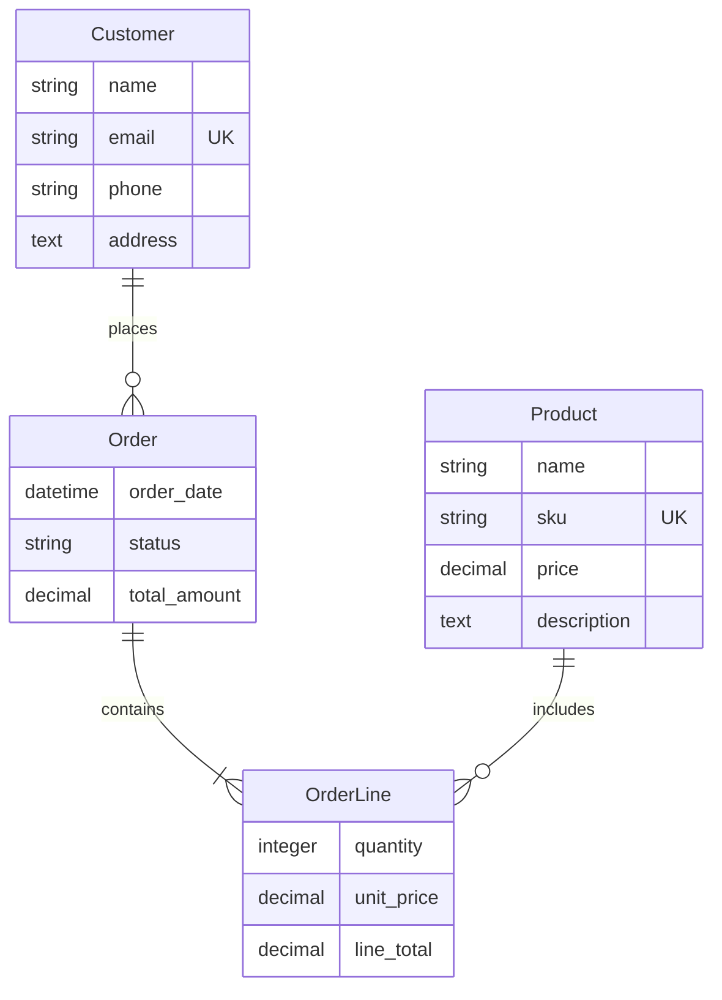

# Compiere Dictionary Generator Enhancement Plan

## Version 6.0 - Complete Multi-Stack Generation with Application Dictionary

**Document Version**: 1.0
**Date**: January 17, 2026
**Author**: ERDwithAI Development Team
**Status**: AWAITING APPROVAL

---

## Table of Contents

1. [Executive Summary](#1-executive-summary)
2. [Current State Analysis](#2-current-state-analysis)
3. [Architecture Overview](#3-architecture-overview)
4. [Application Dictionary Design (sys_ Prefix)](#4-application-dictionary-design-sys_-prefix)
5. [Business Entity Design (bus_ Prefix)](#5-business-entity-design-bus_-prefix)
6. [Runtime UI Layout Modification System](#6-runtime-ui-layout-modification-system)
7. [Multi-Stack Generation](#7-multi-stack-generation)
8. [Template Structure](#8-template-structure)
9. [Implementation Phases](#9-implementation-phases)
10. [File Manifest](#10-file-manifest)
11. [Success Criteria](#11-success-criteria)

---

## 1. Executive Summary

### 1.1 Overview

This enhancement transforms ERDwithAI into a complete application generator that produces enterprise-grade applications following the Compiere Application Dictionary pattern. Every generated project will include:

- **System Tables (sys_ prefix)**: Application Dictionary metadata tables that define the structure, behavior, and layout of the application
- **Business Tables (bus_ prefix)**: User-defined business entities from the ERD design
- **Runtime UI Configuration**: Administrators can modify field order, visibility, and layout at runtime without code changes
- **Two Full-Stack Options**: Choose between Modern Web Stack or Enterprise SAP-Style Stack

### 1.2 Two Full-Stack Generation Options

| Option | Frontend | Backend | Use Case |
|--------|----------|---------|----------|
| **Option 1: Modern Web Stack** | Next.js + Shadcn UI + TanStack | NestJS + Fastify + Knex.js | Modern web applications |
| **Option 2: Enterprise SAP-Style Stack** | OpenUI5 FCL | OData V4 Server (jaystack) | SAP-style enterprise apps |

#### Option 1: Modern Web Stack
- **Frontend**: Next.js 14+ with Shadcn UI components and TanStack libraries (Query, Table, Form)
- **Backend**: NestJS 10+ with Fastify high-performance HTTP server and Knex.js query builder
- **Key Features**: TanStack Query for caching, TanStack Table for dynamic data tables, modern React patterns

#### Option 2: Enterprise SAP-Style Stack
- **Frontend**: OpenUI5 Flexible Column Layout (FCL) with 3-column master-detail pattern
- **Backend**: OData V4 Server using jaystack/odata-v4-server with $metadata endpoint
- **Key Features**: OData protocol compliance, automatic UI binding, enterprise navigation patterns

### 1.3 Key Principles

1. **Metadata-Driven**: The generated application reads UI configuration from sys_ tables at runtime
2. **Separation of Concerns**: System metadata (sys_) is separate from business data (bus_)
3. **Admin Configurable**: UI layout populated randomly during generation, modifiable via admin screens
4. **Template-First**: All generated code comes from external Handlebars templates
5. **Enterprise Patterns**: Following Compiere/iDempiere proven architecture patterns

### 1.4 Naming Conventions

| Prefix | Purpose | Example |
|--------|---------|---------|
| `sys_` | System/Application Dictionary tables | `sys_table`, `sys_column`, `sys_window` |
| `bus_` | Business entity tables | `bus_customer`, `bus_order`, `bus_product` |
| `ad_` | Application Dictionary (legacy compatibility) | Used in type definitions |

---

## 2. Current State Analysis

### 2.1 Existing Capabilities

The current ERDwithAI v5.1 includes:

- **Monorepo Architecture**: 4 packages (core, ai, generator, web)
- **Type Definitions**: Entity, Relationship, and Dictionary types with Zod validation
- **Mermaid Parser**: Extracts entities and relationships from Mermaid ERD syntax
- **Template System**: Handlebars-based with custom helpers
- **AI Integration**: Natural language to Mermaid conversion
- **Web Interface**: Project management, ERD designer, generation UI

### 2.2 Gaps to Address

| Gap | Current State | Enhancement |
|-----|--------------|-------------|
| Dictionary Tables | Type definitions only | Full sys_ table generation with migrations |
| Business Tables | Generic entity generation | bus_ prefixed tables with proper references |
| UI Configuration | Static code generation | Runtime-configurable via sys_field records |
| Stack Generators | Only config templates exist | Complete generators for all stacks |
| Admin Interface | Not implemented | Full admin UI for layout configuration |
| OData Service | No implementation | Complete odata-v4-server integration |
| OpenUI5 FCL | No implementation | Full FCL app with entity menu |

---

## 3. Architecture Overview

### 3.1 Generated Application Architecture

```
┌─────────────────────────────────────────────────────────────────────┐
│                        Generated Application                        │
├─────────────────────────────────────────────────────────────────────┤
│  Frontend Layer (Next.js/Shadcn OR OpenUI5 FCL)                     │
│  ┌─────────────────────────────────────────────────────────────────┐│
│  │  - Reads UI layout from sys_field, sys_tab, sys_window         ││
│  │  - Renders forms, tables, navigation dynamically               ││
│  │  - Admin screens for layout modification                       ││
│  └─────────────────────────────────────────────────────────────────┘│
├─────────────────────────────────────────────────────────────────────┤
│  API Layer (Next.js API Routes OR OData V4 Service)                 │
│  ┌─────────────────────────────────────────────────────────────────┐│
│  │  - CRUD operations for business entities (bus_*)               ││
│  │  - CRUD operations for dictionary entities (sys_*)             ││
│  │  - Hook system for business logic extension                    ││
│  └─────────────────────────────────────────────────────────────────┘│
├─────────────────────────────────────────────────────────────────────┤
│  Database Layer (SQLite/PostgreSQL/MySQL)                           │
│  ┌─────────────────────────────────────────────────────────────────┐│
│  │  System Tables (sys_)        │  Business Tables (bus_)         ││
│  │  ─────────────────────────   │  ─────────────────────────      ││
│  │  sys_table                   │  bus_customer                   ││
│  │  sys_column                  │  bus_order                      ││
│  │  sys_window                  │  bus_product                    ││
│  │  sys_tab                     │  bus_order_line                 ││
│  │  sys_field                   │  ... (from ERD)                 ││
│  │  sys_reference               │                                 ││
│  │  sys_val_rule                │                                 ││
│  │  sys_user                    │                                 ││
│  │  sys_role                    │                                 ││
│  │  sys_access                  │                                 ││
│  └─────────────────────────────────────────────────────────────────┘│
└─────────────────────────────────────────────────────────────────────┘
```

### 3.2 Data Flow

```
┌──────────────────┐     ┌───────────────────┐     ┌──────────────────┐
│  ERD Design      │────▶│  Code Generator   │────▶│  Generated App   │
│  (Mermaid)       │     │  (Handlebars)     │     │                  │
└──────────────────┘     └───────────────────┘     └──────────────────┘
        │                         │                         │
        ▼                         ▼                         ▼
┌──────────────────┐     ┌───────────────────┐     ┌──────────────────┐
│  Parse entities  │     │  1. sys_ tables   │     │  Runtime reads   │
│  & relationships │     │  2. bus_ tables   │     │  sys_ metadata   │
│                  │     │  3. Migrations    │     │  to render UI    │
│                  │     │  4. API routes    │     │                  │
│                  │     │  5. UI components │     │  Admin modifies  │
│                  │     │  6. Admin screens │     │  sys_field order │
└──────────────────┘     └───────────────────┘     └──────────────────┘
```

---

## 4. Application Dictionary Design (sys_ Prefix)

### 4.1 System Tables Overview

The Application Dictionary consists of the following system tables that define application metadata:

#### 4.1.1 sys_table

Defines all tables (both system and business) in the application.

```typescript
interface SysTable {
  sys_table_id: string;           // UUID primary key
  table_name: string;             // Database table name (e.g., 'bus_customer')
  name: string;                   // Display name (e.g., 'Customer')
  description?: string;           // Table description
  table_type: 'system' | 'business'; // sys_ or bus_ table
  access_level: 'System' | 'Organization' | 'Client+Organization' | 'All';
  is_view: boolean;               // True if this is a view
  is_document: boolean;           // True if this supports document workflow
  is_high_volume: boolean;        // True for high-volume tables
  sys_window_id?: string;         // Associated window (if any)
  po_window_id?: string;          // Purchase order window (if any)
  replication_type: 'Local' | 'Reference' | 'Merge';
  etag_column?: string;           // Column used for optimistic concurrency
  created_at: Date;
  updated_at: Date;
  created_by: string;
  updated_by: string;
}
```

#### 4.1.2 sys_column

Defines columns/fields for each table.

```typescript
interface SysColumn {
  sys_column_id: string;          // UUID primary key
  sys_table_id: string;           // FK to sys_table
  column_name: string;            // Database column name (e.g., 'customer_name')
  name: string;                   // Display name (e.g., 'Customer Name')
  description?: string;           // Column description
  sys_reference_id: string;       // FK to sys_reference (determines display type)
  column_sql?: string;            // Virtual column SQL expression
  field_length?: number;          // Max length for strings
  default_value?: string;         // Default value expression
  value_min?: string;             // Minimum value
  value_max?: string;             // Maximum value
  is_key: boolean;                // True if primary key
  is_parent: boolean;             // True if foreign key to parent
  is_mandatory: boolean;          // True if required
  is_updateable: boolean;         // True if can be updated after creation
  is_identifier: boolean;         // True if part of record identifier
  is_translated: boolean;         // True if value is translatable
  is_encrypted: boolean;          // True if value should be encrypted
  is_always_updateable: boolean;  // True if always updateable regardless of status
  is_selection_column: boolean;   // True if shown in search dialog
  is_range: boolean;              // True if range search (from-to)
  seq_no: number;                 // Order in record identifier
  sys_val_rule_id?: string;       // FK to validation rule
  format_pattern?: string;        // Display format pattern
  callout?: string;               // Callout class/function name
  created_at: Date;
  updated_at: Date;
}
```

#### 4.1.3 sys_window

Defines application windows/screens.

```typescript
interface SysWindow {
  sys_window_id: string;          // UUID primary key
  name: string;                   // Window name (e.g., 'Customer Management')
  description?: string;           // Window description
  help?: string;                  // Help text
  window_type: 'M' | 'T' | 'Q';   // Maintain, Transaction, Query
  is_so_trx: boolean;             // True if Sales Order transaction
  is_default: boolean;            // True if default window for table
  window_width?: number;          // Default width
  window_height?: number;         // Default height
  icon_class?: string;            // Icon CSS class
  color_scheme?: string;          // Color scheme name
  is_active: boolean;
  created_at: Date;
  updated_at: Date;
}
```

#### 4.1.4 sys_tab

Defines tabs within windows.

```typescript
interface SysTab {
  sys_tab_id: string;             // UUID primary key
  sys_window_id: string;          // FK to sys_window
  sys_table_id: string;           // FK to sys_table
  name: string;                   // Tab name (e.g., 'Header')
  description?: string;           // Tab description
  help?: string;                  // Help text
  tab_level: number;              // 0=Header, 1+=Lines
  seq_no: number;                 // Display sequence within window
  is_single_row: boolean;         // True if single record view
  is_read_only: boolean;          // True if read-only tab
  is_insert_record: boolean;      // True if new records can be inserted
  is_advanced_tab: boolean;       // True if advanced/hidden by default
  has_tree: boolean;              // True if tree view is supported
  is_info_tab: boolean;           // True if info/summary tab
  link_column_id?: string;        // FK to sys_column (link to parent)
  parent_column_id?: string;      // FK to sys_column (parent's key)
  where_clause?: string;          // Additional WHERE clause
  order_by_clause?: string;       // ORDER BY clause
  commit_warning?: string;        // Warning shown before commit
  is_active: boolean;
  created_at: Date;
  updated_at: Date;
}
```

#### 4.1.5 sys_field

**THE KEY TABLE FOR RUNTIME UI CONFIGURATION**

Defines field placement within tabs. This is where administrators can modify the UI layout at runtime.

```typescript
interface SysField {
  sys_field_id: string;           // UUID primary key
  sys_tab_id: string;             // FK to sys_tab
  sys_column_id: string;          // FK to sys_column
  name: string;                   // Field label (can override column name)
  description?: string;           // Field description (tooltip)
  help?: string;                  // Help text
  is_displayed: boolean;          // True if field is visible
  is_displayed_grid: boolean;     // True if visible in grid/table view
  is_read_only: boolean;          // True if read-only
  is_same_line: boolean;          // True if on same line as previous field
  is_heading: boolean;            // True if this is a section heading
  is_field_only: boolean;         // True if no label shown
  is_encrypted: boolean;          // True if displayed encrypted
  is_mandatory: boolean;          // Override column's mandatory setting
  default_value?: string;         // Override column's default value
  seq_no: number;                 // Display sequence (ORDER BY THIS!)
  seq_no_grid: number;            // Grid/table column sequence
  display_length?: number;        // Display width in characters
  x_position?: number;            // X coordinate (1-6 grid)
  y_position?: number;            // Y position (row number)
  column_span?: number;           // Number of columns to span
  num_lines?: number;             // Number of lines (for text areas)
  sort_no?: number;               // Default sort order
  obscure_type?: string;          // Obscure type (for sensitive data)
  display_logic?: string;         // Conditional display expression
  read_only_logic?: string;       // Conditional read-only expression
  mandatory_logic?: string;       // Conditional mandatory expression
  sys_field_group_id?: string;    // FK to field group
  is_active: boolean;
  created_at: Date;
  updated_at: Date;
}
```

#### 4.1.6 sys_reference

Defines field types and display controls.

```typescript
interface SysReference {
  sys_reference_id: string;       // UUID primary key
  name: string;                   // Reference name (e.g., 'String', 'Integer')
  description?: string;           // Reference description
  validation_type: 'D' | 'L' | 'T' | 'S'; // DataType, List, Table, Search
  entity_type?: string;           // Entity type name
  vformat?: string;               // Display format
  is_order_by_value: boolean;     // True if order by value (not name)
  sys_reference_value_id?: string; // FK to reference value list
  created_at: Date;
  updated_at: Date;
}

// Standard Reference IDs (pre-populated)
const STANDARD_REFERENCES = {
  STRING: '10',
  INTEGER: '11',
  AMOUNT: '12',
  DATE: '15',
  DATETIME: '16',
  LIST: '17',
  TABLE: '18',
  TABLE_DIRECT: '19',
  YES_NO: '20',
  TEXT: '14',
  MEMO: '34',
  ID: '13',
  BINARY: '23',
  BUTTON: '28',
  IMAGE: '32',
  COLOR: '27',
  URL: '40',
  FILE_NAME: '38',
  FILE_PATH: '39',
  LOCATOR: '31',
  SEARCH: '30',
};
```

#### 4.1.7 sys_val_rule

Defines validation rules.

```typescript
interface SysValRule {
  sys_val_rule_id: string;        // UUID primary key
  name: string;                   // Rule name
  description?: string;           // Rule description
  type: 'S' | 'J';                // SQL or JavaScript
  code: string;                   // Validation code
  error_message?: string;         // Error message if validation fails
  sys_table_id?: string;          // FK to table (if table-specific)
  is_active: boolean;
  created_at: Date;
  updated_at: Date;
}
```

#### 4.1.8 sys_field_group

Groups related fields together.

```typescript
interface SysFieldGroup {
  sys_field_group_id: string;     // UUID primary key
  name: string;                   // Group name (e.g., 'Address', 'Contact')
  description?: string;           // Group description
  is_collapsible: boolean;        // True if group can be collapsed
  is_collapsed_by_default: boolean; // True if collapsed by default
  field_group_type: 'C' | 'T' | 'L'; // Collapsible, Tab, Label
  priority: number;               // Display priority
  is_active: boolean;
  created_at: Date;
  updated_at: Date;
}
```

#### 4.1.9 sys_user, sys_role, sys_access, sys_field_access

Authentication and authorization tables.

```typescript
interface SysUser {
  sys_user_id: string;
  username: string;
  email: string;
  password_hash: string;
  name: string;
  description?: string;
  is_active: boolean;
  is_admin: boolean;
  last_login_at?: Date;
  created_at: Date;
  updated_at: Date;
}

interface SysRole {
  sys_role_id: string;
  name: string;
  description?: string;
  is_admin_role: boolean;
  is_manual: boolean;             // True if manually assigned
  user_level: string;             // 'System', 'Client', 'Organization'
  is_active: boolean;
  created_at: Date;
  updated_at: Date;
}

interface SysUserRole {
  sys_user_role_id: string;
  sys_user_id: string;
  sys_role_id: string;
  is_active: boolean;
  created_at: Date;
}

interface SysAccess {
  sys_access_id: string;
  sys_role_id: string;
  sys_table_id?: string;          // Table-level access
  sys_window_id?: string;         // Window-level access
  is_read_only: boolean;
  is_active: boolean;
  created_at: Date;
  updated_at: Date;
}

interface SysFieldAccess {
  sys_field_access_id: string;
  sys_role_id: string;
  sys_field_id: string;
  is_read_only: boolean;
  is_active: boolean;
  created_at: Date;
  updated_at: Date;
}
```

### 4.2 System Table Relationships

```
sys_window (1) ──────┬───────── (N) sys_tab
                     │
                     └───────── sys_table (1) ──── (N) sys_column
                                     │                    │
                                     │                    ├── sys_reference
                                     │                    │
                                     │                    └── sys_val_rule
                                     │
                                     └───────────────── (N) sys_field
                                                            │
                                                            └── sys_field_group

sys_user (N) ──────── sys_user_role ──────── (N) sys_role
                                                    │
                                                    ├── sys_access
                                                    │
                                                    └── sys_field_access
```

---

## 5. Business Entity Design (bus_ Prefix)

### 5.1 Naming Convention

All business entities from the ERD design will be generated with a `bus_` prefix:

| ERD Entity | Database Table | Display Name |
|------------|----------------|--------------|
| Customer | bus_customer | Customer |
| Order | bus_order | Order |
| Product | bus_product | Product |
| OrderLine | bus_order_line | Order Line |
| Category | bus_category | Category |

### 5.2 Standard Columns

Every business table includes standard columns:

```typescript
interface StandardBusinessColumns {
  // Primary Key
  [entity_name]_id: string;       // e.g., bus_customer_id

  // Optimistic Concurrency
  etag: string;                   // Version-timestamp format

  // Audit Trail
  created_at: Date;
  created_by: string;             // FK to sys_user
  updated_at: Date;
  updated_by: string;             // FK to sys_user

  // Soft Delete
  is_active: boolean;

  // Multi-tenancy (optional)
  tenant_id?: string;
  organization_id?: string;
}
```

### 5.3 Generation from ERD

When the user creates an ERD like:



The generator produces:

1. **Business Tables** (bus_*)
2. **Dictionary Entries** (sys_table, sys_column, sys_window, sys_tab, sys_field)
3. **Initial UI Layout** (randomly ordered fields, adjustable at runtime)

---

## 6. Runtime UI Layout Modification System

### 6.1 How It Works

1. **At Generation Time**:
   - Generator creates sys_table, sys_column entries for each entity
   - Generator creates sys_window with sys_tab entries
   - Generator creates sys_field entries with **random seq_no values**
   - Frontend reads these entries to render forms/tables

2. **At Runtime**:
   - Administrator accesses the "Dictionary Admin" screen
   - Administrator can reorder fields by changing seq_no
   - Administrator can hide/show fields by toggling is_displayed
   - Administrator can group fields by assigning sys_field_group_id
   - Changes take effect immediately (no code regeneration needed)

### 6.2 Admin Interface Components

#### Dictionary Admin Window
```
┌─────────────────────────────────────────────────────────────────────┐
│  Dictionary Administration                                          │
├─────────────────────────────────────────────────────────────────────┤
│  ┌─────────────────────────────────────────────────────────────────┐│
│  │  Tables | Windows | Tabs | Fields | References | Validation     ││
│  └─────────────────────────────────────────────────────────────────┘│
│                                                                     │
│  ┌─────────────────┬───────────────────────────────────────────────┐│
│  │ Window List     │  Field Layout Editor                          ││
│  │ ─────────────── │  ────────────────────────────────             ││
│  │ > Customers     │  Tab: Customer Details                        ││
│  │   Orders        │  ┌───────────────────────────────────────────┐││
│  │   Products      │  │ Field           │ Seq │ Visible │ Group  │││
│  │   Order Lines   │  │ ──────────────  │ ─── │ ─────── │ ────── │││
│  │                 │  │ ☰ Customer Name │  10 │   ✓     │ Basic  │││
│  │                 │  │ ☰ Email         │  20 │   ✓     │ Basic  │││
│  │                 │  │ ☰ Phone         │  30 │   ✓     │ Contact│││
│  │                 │  │ ☰ Address       │  40 │   ✓     │ Contact│││
│  │                 │  │ ☰ Created At    │  50 │   ☐     │ Audit  │││
│  │                 │  └───────────────────────────────────────────┘││
│  │                 │  [Drag to reorder] [Save Changes]             ││
│  └─────────────────┴───────────────────────────────────────────────┘│
└─────────────────────────────────────────────────────────────────────┘
```

### 6.3 Frontend Rendering Logic

The frontend queries sys_field to determine how to render forms:

```typescript
// Pseudocode for dynamic form rendering
async function renderEntityForm(entityName: string) {
  // 1. Get table info
  const table = await api.get(`/api/sys/tables?name=bus_${entityName}`);

  // 2. Get window and tab
  const window = await api.get(`/api/sys/windows/${table.sys_window_id}`);
  const tabs = await api.get(`/api/sys/tabs?window_id=${window.sys_window_id}`);

  // 3. Get fields ordered by seq_no
  const fields = await api.get(
    `/api/sys/fields?tab_id=${tabs[0].sys_tab_id}&is_displayed=true&order_by=seq_no`
  );

  // 4. Get columns for type info
  const columns = await api.get(`/api/sys/columns?table_id=${table.sys_table_id}`);

  // 5. Render form with fields in seq_no order
  return (
    <Form>
      {fields.map(field => {
        const column = columns.find(c => c.sys_column_id === field.sys_column_id);
        return <DynamicField key={field.sys_field_id} field={field} column={column} />;
      })}
    </Form>
  );
}
```

---

## 7. Full-Stack Generation Options

This generator provides exactly **TWO full-stack options**. Each option includes a complete frontend and backend pairing.

### 7.1 Stack Options Overview

| Option | Frontend | Backend | Use Case |
|--------|----------|---------|----------|
| **Option 1: Modern Web Stack** | Next.js + Shadcn UI + TanStack | NestJS + Fastify + Knex.js | Modern web applications |
| **Option 2: Enterprise SAP-Style Stack** | OpenUI5 FCL | OData V4 Server (jaystack) | SAP-style enterprise apps |

---

## 7.2 Option 1: Modern Web Stack

### Technology Stack

| Layer | Technology | Purpose |
|-------|------------|---------|
| **Frontend Framework** | Next.js 14+ | React-based full-stack framework |
| **UI Components** | Shadcn UI | Beautiful, accessible React components |
| **Data Fetching** | TanStack Query (React Query) | Server state management, caching |
| **Tables** | TanStack Table | Powerful headless table library |
| **Forms** | TanStack Form + Zod | Type-safe form handling with validation |
| **Backend Framework** | NestJS 10+ | Enterprise-grade Node.js framework |
| **HTTP Server** | Fastify | High-performance HTTP server |
| **Database** | Knex.js | SQL query builder |
| **Validation** | Zod | Runtime type validation |

### Key Libraries from TanStack (https://tanstack.com/)

- **@tanstack/react-query**: Async state management, caching, background updates
- **@tanstack/react-table**: Headless table with sorting, filtering, pagination
- **@tanstack/react-form**: Type-safe form state management
- **@tanstack/react-virtual**: Virtualized lists for large datasets

### Generated Frontend Structure (Next.js + Shadcn + TanStack)

```
generated-frontend/
├── app/
│   ├── layout.tsx                  # Root layout with providers
│   ├── page.tsx                    # Landing page
│   ├── globals.css                 # Global styles (Tailwind)
│   ├── providers.tsx               # TanStack Query provider
│   │
│   ├── (dashboard)/
│   │   ├── layout.tsx              # Dashboard layout with sidebar
│   │   ├── page.tsx                # Dashboard home
│   │   │
│   │   ├── [entity]/               # Dynamic entity routes
│   │   │   ├── page.tsx            # Entity list (TanStack Table)
│   │   │   ├── [id]/
│   │   │   │   └── page.tsx        # Entity detail (CRUD)
│   │   │   └── new/
│   │   │       └── page.tsx        # Create new entity
│   │   │
│   │   └── admin/
│   │       ├── page.tsx            # Admin dashboard
│   │       ├── dictionary/
│   │       │   ├── page.tsx        # Dictionary admin
│   │       │   ├── tables/page.tsx
│   │       │   ├── windows/page.tsx
│   │       │   └── fields/page.tsx # Field layout editor (drag-drop)
│   │       ├── users/page.tsx
│   │       └── roles/page.tsx
│   │
│   └── api/                        # API routes (proxy to NestJS)
│       └── [...proxy]/route.ts     # Proxy to NestJS backend
│
├── components/
│   ├── ui/                         # Shadcn UI components
│   │   ├── button.tsx
│   │   ├── dialog.tsx
│   │   ├── form.tsx
│   │   ├── input.tsx
│   │   ├── select.tsx
│   │   ├── table.tsx
│   │   ├── data-table.tsx          # TanStack Table wrapper
│   │   ├── skeleton.tsx
│   │   ├── toast.tsx
│   │   └── ...
│   │
│   ├── entity/
│   │   ├── dynamic-form.tsx        # Renders form from sys_field (TanStack Form)
│   │   ├── dynamic-table.tsx       # Renders table from sys_field (TanStack Table)
│   │   ├── entity-list.tsx         # Entity list with TanStack Query
│   │   ├── entity-detail.tsx       # Entity detail with mutations
│   │   └── entity-delete-dialog.tsx
│   │
│   ├── admin/
│   │   ├── field-layout-editor.tsx # Drag-drop field reordering
│   │   ├── table-editor.tsx
│   │   └── window-editor.tsx
│   │
│   ├── providers/
│   │   └── query-provider.tsx      # TanStack Query provider
│   │
│   └── layout/
│       ├── sidebar.tsx
│       ├── header.tsx
│       └── navigation.tsx
│
├── lib/
│   ├── api-client.ts               # API client with TanStack Query hooks
│   ├── queries/                    # TanStack Query hooks
│   │   ├── use-entities.ts         # Entity queries
│   │   ├── use-dictionary.ts       # Dictionary queries
│   │   └── use-mutations.ts        # CRUD mutations
│   └── utils.ts                    # Utilities
│
├── hooks/
│   ├── use-dynamic-form.ts         # Dynamic form hook
│   └── use-dynamic-columns.ts      # Dynamic table columns hook
│
├── package.json
├── tsconfig.json
├── tailwind.config.ts
├── next.config.ts
└── components.json                 # Shadcn UI config
```

### Generated Backend Structure (NestJS + Fastify + Knex.js)

```
generated-backend/
├── src/
│   ├── main.ts                     # Application entry (Fastify adapter)
│   ├── app.module.ts               # Root module
│   │
│   ├── common/
│   │   ├── decorators/             # Custom decorators
│   │   │   ├── api-etag.decorator.ts
│   │   │   └── current-user.decorator.ts
│   │   ├── filters/                # Exception filters
│   │   │   └── http-exception.filter.ts
│   │   ├── guards/                 # Auth guards
│   │   │   └── auth.guard.ts
│   │   ├── interceptors/           # Interceptors
│   │   │   ├── etag.interceptor.ts
│   │   │   └── logging.interceptor.ts
│   │   └── pipes/                  # Validation pipes
│   │       └── zod-validation.pipe.ts
│   │
│   ├── database/
│   │   ├── database.module.ts      # Knex.js module
│   │   ├── database.service.ts     # Database service
│   │   ├── migrations/
│   │   │   ├── 001_sys_tables.ts   # System tables
│   │   │   └── 002_bus_tables.ts   # Business tables
│   │   └── seeds/
│   │       ├── 001_sys_references.ts
│   │       └── 002_sys_dictionary.ts
│   │
│   ├── modules/
│   │   ├── sys/                    # System modules (Application Dictionary)
│   │   │   ├── sys.module.ts
│   │   │   ├── controllers/
│   │   │   │   ├── sys-table.controller.ts
│   │   │   │   ├── sys-column.controller.ts
│   │   │   │   ├── sys-window.controller.ts
│   │   │   │   ├── sys-tab.controller.ts
│   │   │   │   ├── sys-field.controller.ts
│   │   │   │   ├── sys-reference.controller.ts
│   │   │   │   ├── sys-user.controller.ts
│   │   │   │   └── sys-role.controller.ts
│   │   │   ├── services/
│   │   │   │   ├── sys-table.service.ts
│   │   │   │   ├── sys-column.service.ts
│   │   │   │   ├── sys-field.service.ts
│   │   │   │   └── ...
│   │   │   └── dto/
│   │   │       ├── create-sys-table.dto.ts
│   │   │       └── update-sys-field.dto.ts
│   │   │
│   │   ├── bus/                    # Business modules (from ERD)
│   │   │   ├── bus.module.ts
│   │   │   ├── controllers/
│   │   │   │   ├── bus-customer.controller.ts
│   │   │   │   ├── bus-order.controller.ts
│   │   │   │   └── ... (generated per entity)
│   │   │   ├── services/
│   │   │   │   ├── bus-customer.service.ts
│   │   │   │   ├── bus-order.service.ts
│   │   │   │   └── ...
│   │   │   └── dto/
│   │   │       ├── create-bus-customer.dto.ts
│   │   │       └── ...
│   │   │
│   │   └── auth/                   # Authentication module
│   │       ├── auth.module.ts
│   │       ├── auth.controller.ts
│   │       └── auth.service.ts
│   │
│   └── config/
│       ├── configuration.ts        # App configuration
│       └── knex.config.ts          # Knex configuration
│
├── knexfile.ts                     # Knex CLI config
├── package.json
├── tsconfig.json
├── nest-cli.json
└── .env.example
```

### TanStack Integration Examples

#### TanStack Query - Data Fetching
```typescript
// lib/queries/use-entities.ts
import { useQuery, useMutation, useQueryClient } from '@tanstack/react-query';

export function useEntities(entityName: string) {
  return useQuery({
    queryKey: ['entities', entityName],
    queryFn: () => api.get(`/api/bus/${entityName}`),
    staleTime: 5 * 60 * 1000, // 5 minutes
  });
}

export function useCreateEntity(entityName: string) {
  const queryClient = useQueryClient();
  return useMutation({
    mutationFn: (data) => api.post(`/api/bus/${entityName}`, data),
    onSuccess: () => {
      queryClient.invalidateQueries({ queryKey: ['entities', entityName] });
    },
  });
}
```

#### TanStack Table - Dynamic Columns from sys_field
```typescript
// components/entity/dynamic-table.tsx
import { useReactTable, getCoreRowModel, getSortedRowModel } from '@tanstack/react-table';

export function DynamicTable({ entityName }: { entityName: string }) {
  const { data: fields } = useQuery({
    queryKey: ['sys_fields', entityName],
    queryFn: () => api.get(`/api/sys/fields?entity=${entityName}&order_by=seq_no`),
  });

  const columns = useMemo(() =>
    fields?.filter(f => f.is_displayed_grid).map(field => ({
      accessorKey: field.column_name,
      header: field.name,
      enableSorting: true,
    })) ?? [],
    [fields]
  );

  const table = useReactTable({
    data: entities,
    columns,
    getCoreRowModel: getCoreRowModel(),
    getSortedRowModel: getSortedRowModel(),
  });

  // ... render table
}
```

---

## 7.3 Option 2: Enterprise SAP-Style Stack

### Technology Stack

| Layer | Technology | Purpose |
|-------|------------|---------|
| **Frontend Framework** | OpenUI5 1.120+ | SAP enterprise UI framework |
| **Layout** | Flexible Column Layout (FCL) | 3-column master-detail pattern |
| **Data Binding** | OData V4 Model | Automatic data binding |
| **Backend** | odata-v4-server (jaystack) | OData V4 protocol implementation |
| **Database** | Knex.js | SQL query builder |

### OpenUI5 FCL Architecture

```
┌─────────────────────────────────────────────────────────────────────┐
│                    Flexible Column Layout (FCL)                      │
├────────────────┬────────────────────┬───────────────────────────────┤
│   Column 1     │     Column 2       │         Column 3              │
│   (Master)     │     (List)         │         (Detail)              │
├────────────────┼────────────────────┼───────────────────────────────┤
│                │                    │                               │
│  Entity Menu   │  Entity Records    │  Object Page                  │
│  ───────────   │  ──────────────    │  ───────────────              │
│                │                    │                               │
│  > Customers   │  ┌──────────────┐  │  ┌───────────────────────┐   │
│    Orders      │  │ John Doe     │  │  │ Header: John Doe      │   │
│    Products    │  │ jane@ex.com  │  │  │ Email: john@ex.com    │   │
│    Categories  │  ├──────────────┤  │  ├───────────────────────┤   │
│                │  │ Jane Smith   │  │  │ Section: Details      │   │
│  (from         │  │ jane@ex.com  │  │  │ ┌─────────────────┐   │   │
│  $metadata)    │  ├──────────────┤  │  │ │ Field 1         │   │   │
│                │  │ Bob Wilson   │  │  │ │ Field 2         │   │   │
│                │  │ bob@ex.com   │  │  │ │ Field 3         │   │   │
│                │  └──────────────┘  │  │ └─────────────────┘   │   │
│                │                    │  │                       │   │
│                │  [+ Create]        │  │ Section: Related      │   │
│                │  (Growing Table)   │  │ [Edit] [Delete]       │   │
│                │                    │  └───────────────────────┘   │
└────────────────┴────────────────────┴───────────────────────────────┘
```

### Generated Backend Structure (OData V4 Server)

```
generated-odata-backend/
├── src/
│   ├── server.ts                   # OData server entry point
│   ├── app.ts                      # Express/OData app setup
│   │
│   ├── controllers/
│   │   ├── base.controller.ts      # Base OData controller with CRUD
│   │   │
│   │   ├── sys/                    # System entity controllers
│   │   │   ├── sys-table.controller.ts
│   │   │   ├── sys-column.controller.ts
│   │   │   ├── sys-window.controller.ts
│   │   │   ├── sys-tab.controller.ts
│   │   │   ├── sys-field.controller.ts
│   │   │   ├── sys-reference.controller.ts
│   │   │   ├── sys-user.controller.ts
│   │   │   ├── sys-role.controller.ts
│   │   │   └── index.ts
│   │   │
│   │   └── bus/                    # Business entity controllers
│   │       ├── bus-customer.controller.ts
│   │       ├── bus-order.controller.ts
│   │       ├── bus-product.controller.ts
│   │       └── index.ts            # Generated per entity
│   │
│   ├── models/
│   │   ├── base.model.ts           # Base model with common fields
│   │   ├── sys/                    # System models
│   │   │   ├── sys-table.model.ts
│   │   │   └── ...
│   │   └── bus/                    # Business models
│   │       ├── bus-customer.model.ts
│   │       └── ...
│   │
│   ├── metadata/
│   │   ├── edmx-builder.ts         # Dynamic $metadata generator
│   │   ├── annotations.ts          # OData annotations for UI5
│   │   └── entity-sets.ts          # Entity set definitions
│   │
│   ├── database/
│   │   ├── connection.ts           # Knex.js connection
│   │   ├── migrations/
│   │   │   ├── 001_sys_tables.ts
│   │   │   └── 002_bus_tables.ts
│   │   └── seeds/
│   │       ├── 001_sys_references.ts
│   │       └── 002_sys_dictionary.ts
│   │
│   └── config/
│       ├── odata.config.ts         # OData server config
│       └── database.config.ts      # Database config
│
├── knexfile.ts
├── package.json
├── tsconfig.json
└── .env.example
```

### Generated Frontend Structure (OpenUI5 FCL)

```
generated-ui5-frontend/
├── webapp/
│   ├── manifest.json               # UI5 app descriptor with OData model
│   ├── Component.js                # Main component
│   ├── index.html                  # Entry point
│   │
│   ├── controller/
│   │   ├── App.controller.js       # Main FCL controller
│   │   ├── Master.controller.js    # Entity menu (Column 1)
│   │   ├── List.controller.js      # Entity list (Column 2)
│   │   ├── Detail.controller.js    # Object page (Column 3)
│   │   ├── Create.controller.js    # Create dialog controller
│   │   └── Admin.controller.js     # Dictionary admin controller
│   │
│   ├── view/
│   │   ├── App.view.xml            # FCL container
│   │   ├── Master.view.xml         # Entity menu from $metadata
│   │   ├── List.view.xml           # Growing table
│   │   ├── Detail.view.xml         # Object page with sections
│   │   ├── Create.view.xml         # Create form
│   │   └── Admin.view.xml          # Dictionary administration
│   │
│   ├── fragment/
│   │   ├── CreateDialog.fragment.xml    # Create entity dialog
│   │   ├── DeleteDialog.fragment.xml    # Delete confirmation
│   │   ├── EditDialog.fragment.xml      # Edit entity dialog
│   │   └── FieldGroup.fragment.xml      # Dynamic field group
│   │
│   ├── model/
│   │   ├── models.js               # Model factory
│   │   ├── formatter.js            # Value formatters
│   │   └── types.js                # Custom types
│   │
│   ├── css/
│   │   └── style.css               # Custom styles
│   │
│   └── i18n/
│       ├── i18n.properties         # English
│       └── i18n_de.properties      # German (example)
│
├── package.json
├── ui5.yaml                        # UI5 tooling config
└── .ui5lintrc.json                 # UI5 linter config
```

### FCL Implementation Details

#### Column 1: Entity Menu (Master View)
- Dynamically reads $metadata to get list of entity sets
- Filters to show only bus_ entities (business entities)
- Displays entity names with icons
- Navigation to entity list on selection
- Highlights currently selected entity

#### Column 2: Entity List (List View)
- Growing table with automatic pagination
- Reads sys_field (via OData) for column configuration
- Columns ordered by sys_field.seq_no_grid
- Supports search, filter, sort
- Selection navigates to detail
- Create button opens create dialog

#### Column 3: Entity Detail (Detail View)
- Object page layout with header and sections
- Sections generated from sys_field_group
- Fields ordered by sys_field.seq_no
- Fields read sys_field for:
  - Display/hide (is_displayed)
  - Read-only (is_read_only)
  - Mandatory (is_mandatory)
  - Field type (sys_reference_id)
- Full CRUD operations:
  - Edit mode toggle
  - Save with ETag concurrency
  - Delete with confirmation
- Related entities shown in separate sections

### OData V4 Features

#### $metadata Endpoint
- Dynamically generated from sys_table and sys_column
- Includes navigation properties from relationships
- Annotations for UI5 rendering hints

#### Supported OData Operations
- `$filter` - Filtering with OData syntax
- `$orderby` - Sorting
- `$top` / `$skip` - Pagination
- `$expand` - Related entity expansion
- `$select` - Field selection
- `$count` - Record counting

#### ETag Support
- Optimistic concurrency control
- Version-timestamp format
- Automatic conflict detection

---

## 8. Template Structure

### 8.1 Template Organization

Templates are organized by the two full-stack options:

```
packages/generator/templates/
├── common/                                 # Shared templates for both stacks
│   ├── migrations/
│   │   ├── sys-tables.migration.ts.hbs     # System tables (Application Dictionary)
│   │   ├── sys-seeds.ts.hbs                # Reference data seeds
│   │   ├── bus-table.migration.ts.hbs      # Business table template
│   │   └── bus-seeds.ts.hbs                # Dictionary entries for bus_ tables
│   │
│   └── types/
│       ├── sys-types.ts.hbs                # System type definitions
│       └── bus-entity.type.ts.hbs          # Business entity types
│
├── option1-modern-web/                     # Option 1: Next.js + NestJS Stack
│   │
│   ├── frontend/                           # Next.js + Shadcn + TanStack
│   │   ├── config/
│   │   │   ├── package.json.hbs
│   │   │   ├── tsconfig.json.hbs
│   │   │   ├── next.config.ts.hbs
│   │   │   ├── tailwind.config.ts.hbs
│   │   │   └── components.json.hbs         # Shadcn config
│   │   │
│   │   ├── app/
│   │   │   ├── layout.tsx.hbs
│   │   │   ├── page.tsx.hbs
│   │   │   ├── globals.css.hbs
│   │   │   ├── providers.tsx.hbs           # TanStack Query provider
│   │   │   ├── dashboard-layout.tsx.hbs
│   │   │   ├── entity-list-page.tsx.hbs
│   │   │   ├── entity-detail-page.tsx.hbs
│   │   │   ├── entity-new-page.tsx.hbs
│   │   │   └── admin-page.tsx.hbs
│   │   │
│   │   ├── components/
│   │   │   ├── ui/                         # Shadcn UI components
│   │   │   │   ├── button.tsx.hbs
│   │   │   │   ├── dialog.tsx.hbs
│   │   │   │   ├── form.tsx.hbs
│   │   │   │   ├── input.tsx.hbs
│   │   │   │   ├── select.tsx.hbs
│   │   │   │   ├── table.tsx.hbs
│   │   │   │   ├── data-table.tsx.hbs      # TanStack Table wrapper
│   │   │   │   ├── skeleton.tsx.hbs
│   │   │   │   └── toast.tsx.hbs
│   │   │   │
│   │   │   ├── entity/
│   │   │   │   ├── dynamic-form.tsx.hbs    # TanStack Form integration
│   │   │   │   ├── dynamic-table.tsx.hbs   # TanStack Table integration
│   │   │   │   ├── entity-list.tsx.hbs
│   │   │   │   ├── entity-detail.tsx.hbs
│   │   │   │   └── entity-delete-dialog.tsx.hbs
│   │   │   │
│   │   │   ├── admin/
│   │   │   │   ├── field-layout-editor.tsx.hbs
│   │   │   │   ├── table-editor.tsx.hbs
│   │   │   │   └── window-editor.tsx.hbs
│   │   │   │
│   │   │   ├── providers/
│   │   │   │   └── query-provider.tsx.hbs
│   │   │   │
│   │   │   └── layout/
│   │   │       ├── sidebar.tsx.hbs
│   │   │       ├── header.tsx.hbs
│   │   │       └── navigation.tsx.hbs
│   │   │
│   │   ├── lib/
│   │   │   ├── api-client.ts.hbs
│   │   │   └── utils.ts.hbs
│   │   │
│   │   └── hooks/
│   │       ├── use-entities.ts.hbs         # TanStack Query hooks
│   │       ├── use-dictionary.ts.hbs
│   │       ├── use-mutations.ts.hbs
│   │       ├── use-dynamic-form.ts.hbs
│   │       └── use-dynamic-columns.ts.hbs
│   │
│   └── backend/                            # NestJS + Fastify + Knex.js
│       ├── config/
│       │   ├── package.json.hbs
│       │   ├── tsconfig.json.hbs
│       │   ├── nest-cli.json.hbs
│       │   └── knexfile.ts.hbs
│       │
│       ├── src/
│       │   ├── main.ts.hbs                 # Fastify adapter entry
│       │   ├── app.module.ts.hbs
│       │   │
│       │   ├── common/
│       │   │   ├── decorators/
│       │   │   │   ├── api-etag.decorator.ts.hbs
│       │   │   │   └── current-user.decorator.ts.hbs
│       │   │   ├── filters/
│       │   │   │   └── http-exception.filter.ts.hbs
│       │   │   ├── guards/
│       │   │   │   └── auth.guard.ts.hbs
│       │   │   ├── interceptors/
│       │   │   │   ├── etag.interceptor.ts.hbs
│       │   │   │   └── logging.interceptor.ts.hbs
│       │   │   └── pipes/
│       │   │       └── zod-validation.pipe.ts.hbs
│       │   │
│       │   ├── database/
│       │   │   ├── database.module.ts.hbs
│       │   │   └── database.service.ts.hbs
│       │   │
│       │   ├── modules/
│       │   │   ├── sys/
│       │   │   │   ├── sys.module.ts.hbs
│       │   │   │   ├── sys-controller.ts.hbs
│       │   │   │   └── sys-service.ts.hbs
│       │   │   │
│       │   │   ├── bus/
│       │   │   │   ├── bus.module.ts.hbs
│       │   │   │   ├── bus-controller.ts.hbs
│       │   │   │   └── bus-service.ts.hbs
│       │   │   │
│       │   │   └── auth/
│       │   │       ├── auth.module.ts.hbs
│       │   │       ├── auth.controller.ts.hbs
│       │   │       └── auth.service.ts.hbs
│       │   │
│       │   └── config/
│       │       ├── configuration.ts.hbs
│       │       └── knex.config.ts.hbs
│       │
│       └── dto/
│           ├── create-entity.dto.ts.hbs
│           └── update-entity.dto.ts.hbs
│
└── option2-enterprise-sap/                 # Option 2: OpenUI5 + OData Stack
    │
    ├── frontend/                           # OpenUI5 FCL
    │   ├── config/
    │   │   ├── package.json.hbs
    │   │   ├── ui5.yaml.hbs
    │   │   └── .ui5lintrc.json.hbs
    │   │
    │   ├── webapp/
    │   │   ├── manifest.json.hbs           # App descriptor with OData model
    │   │   ├── Component.js.hbs
    │   │   ├── index.html.hbs
    │   │   │
    │   │   ├── controller/
    │   │   │   ├── App.controller.js.hbs
    │   │   │   ├── Master.controller.js.hbs    # Entity menu (Column 1)
    │   │   │   ├── List.controller.js.hbs      # Entity list (Column 2)
    │   │   │   ├── Detail.controller.js.hbs    # Object page (Column 3)
    │   │   │   ├── Create.controller.js.hbs
    │   │   │   └── Admin.controller.js.hbs
    │   │   │
    │   │   ├── view/
    │   │   │   ├── App.view.xml.hbs            # FCL layout
    │   │   │   ├── Master.view.xml.hbs
    │   │   │   ├── List.view.xml.hbs           # Growing table
    │   │   │   ├── Detail.view.xml.hbs         # Object page
    │   │   │   ├── Create.view.xml.hbs
    │   │   │   └── Admin.view.xml.hbs
    │   │   │
    │   │   ├── fragment/
    │   │   │   ├── CreateDialog.fragment.xml.hbs
    │   │   │   ├── DeleteDialog.fragment.xml.hbs
    │   │   │   ├── EditDialog.fragment.xml.hbs
    │   │   │   └── FieldGroup.fragment.xml.hbs
    │   │   │
    │   │   ├── model/
    │   │   │   ├── models.js.hbs
    │   │   │   ├── formatter.js.hbs
    │   │   │   └── types.js.hbs
    │   │   │
    │   │   ├── css/
    │   │   │   └── style.css.hbs
    │   │   │
    │   │   └── i18n/
    │   │       └── i18n.properties.hbs
    │
    └── backend/                            # OData V4 Server (jaystack)
        ├── config/
        │   ├── package.json.hbs
        │   ├── tsconfig.json.hbs
        │   └── knexfile.ts.hbs
        │
        ├── src/
        │   ├── server.ts.hbs               # OData server entry
        │   ├── app.ts.hbs                  # Express + OData setup
        │   │
        │   ├── controllers/
        │   │   ├── base.controller.ts.hbs  # Base OData controller
        │   │   ├── sys-controller.ts.hbs   # System entity controller
        │   │   └── bus-controller.ts.hbs   # Business entity controller
        │   │
        │   ├── models/
        │   │   ├── base.model.ts.hbs
        │   │   ├── sys-model.ts.hbs
        │   │   └── bus-model.ts.hbs
        │   │
        │   ├── metadata/
        │   │   ├── edmx-builder.ts.hbs     # $metadata generator
        │   │   ├── annotations.ts.hbs      # OData annotations
        │   │   └── entity-sets.ts.hbs
        │   │
        │   ├── database/
        │   │   └── connection.ts.hbs
        │   │
        │   └── config/
        │       ├── odata.config.ts.hbs
        │       └── database.config.ts.hbs
```

### 8.2 Template Context Variables

All templates receive a standardized context:

```typescript
interface TemplateContext {
  // Project Info
  project: {
    name: string;
    description: string;
    version: string;
    author: string;
  };

  // Configuration
  config: {
    stackOption: 'option1-modern-web' | 'option2-enterprise-sap';
    databaseType: 'sqlite' | 'postgres' | 'mysql';
    frontendPort: number;
    backendPort: number;
    baseUrl: string;
  };

  // Entities (with bus_ prefix)
  entities: Array<{
    name: string;              // Original name (e.g., 'Customer')
    tableName: string;         // bus_customer
    displayName: string;       // 'Customer'
    pluralName: string;        // 'Customers'
    attributes: EntityAttribute[];
    relationships: Relationship[];
    primaryKey: string;
  }>;

  // System Tables (sys_ prefix)
  systemTables: SysTable[];

  // Relationships
  relationships: Relationship[];

  // References (for dropdown types)
  references: SysReference[];

  // Generation timestamp
  generatedAt: string;
}
```

### 8.3 Handlebars Helpers

Additional helpers for the enhanced templates:

```typescript
// Table name helpers
Handlebars.registerHelper('sysTableName', (name) => `sys_${snakeCase(name)}`);
Handlebars.registerHelper('busTableName', (name) => `bus_${snakeCase(name)}`);

// Column name helpers
Handlebars.registerHelper('sysColumnId', (table) => `sys_${snakeCase(table)}_id`);
Handlebars.registerHelper('busColumnId', (entity) => `bus_${snakeCase(entity)}_id`);

// Reference type mapping
Handlebars.registerHelper('toReferenceId', (type) => {
  const mapping = {
    'string': '10',
    'integer': '11',
    'decimal': '12',
    'date': '15',
    'datetime': '16',
    'boolean': '20',
    'text': '14',
    'json': '36',
  };
  return mapping[type] || '10';
});

// Random sequence generator (for initial field ordering)
Handlebars.registerHelper('randomSeq', (index) => (index + 1) * 10 + Math.floor(Math.random() * 5));

// Conditional helpers
Handlebars.registerHelper('isSystemTable', (name) => name.startsWith('sys_'));
Handlebars.registerHelper('isBusinessTable', (name) => name.startsWith('bus_'));

// TanStack helpers (Option 1)
Handlebars.registerHelper('tanstackQueryKey', (entity) => `['${entity}', 'list']`);
Handlebars.registerHelper('tanstackMutationKey', (entity, action) => `['${entity}', '${action}']`);

// NestJS helpers (Option 1)
Handlebars.registerHelper('nestControllerName', (entity) => `${pascalCase(entity)}Controller`);
Handlebars.registerHelper('nestServiceName', (entity) => `${pascalCase(entity)}Service`);
Handlebars.registerHelper('nestModuleName', (entity) => `${pascalCase(entity)}Module`);

// UI5 specific helpers (Option 2)
Handlebars.registerHelper('ui5Type', (type) => {
  const mapping = {
    'string': 'sap.ui.model.type.String',
    'integer': 'sap.ui.model.type.Integer',
    'decimal': 'sap.ui.model.odata.type.Decimal',
    'date': 'sap.ui.model.type.Date',
    'datetime': 'sap.ui.model.type.DateTime',
    'boolean': 'sap.ui.model.type.Boolean',
  };
  return mapping[type] || 'sap.ui.model.type.String';
});

Handlebars.registerHelper('ui5ControlType', (referenceId) => {
  const mapping = {
    '10': 'sap.m.Input',           // String
    '11': 'sap.m.Input',           // Integer (with constraints)
    '12': 'sap.m.Input',           // Amount/Decimal
    '14': 'sap.m.TextArea',        // Text/Memo
    '15': 'sap.m.DatePicker',      // Date
    '16': 'sap.m.DateTimePicker',  // DateTime
    '20': 'sap.m.CheckBox',        // Yes/No
    '17': 'sap.m.Select',          // List
    '18': 'sap.m.Select',          // Table
  };
  return mapping[referenceId] || 'sap.m.Input';
});

// OData EDM type mapping (Option 2)
Handlebars.registerHelper('edmType', (type) => {
  const mapping = {
    'string': 'Edm.String',
    'integer': 'Edm.Int32',
    'decimal': 'Edm.Decimal',
    'date': 'Edm.Date',
    'datetime': 'Edm.DateTimeOffset',
    'boolean': 'Edm.Boolean',
    'text': 'Edm.String',
    'json': 'Edm.String',
  };
  return mapping[type] || 'Edm.String';
});

// OData navigation helpers
Handlebars.registerHelper('odataNavigationProperty', (relationship) => {
  if (relationship.type === 'oneToMany') {
    return `Collection(${relationship.targetEntity})`;
  }
  return relationship.targetEntity;
});
```

---

## 9. Implementation Phases

### Phase 1: Core Infrastructure

**Objective**: Establish the sys_ table infrastructure and enhanced type system.

**Tasks**:
1. Enhance `packages/core/src/types/dictionary.types.ts` with complete sys_ types
2. Create `packages/core/src/types/business.types.ts` for bus_ entity handling
3. Create `packages/core/src/utils/table-naming.ts` for sys_/bus_ naming utilities
4. Create common migration templates for sys_ tables
5. Create seed data for sys_reference standard types
6. Update template loader with new helpers (30+ helpers)

**Deliverables**:
- Complete type definitions for sys_ and bus_ entities
- Common migration templates
- Seed templates for reference data
- 30+ new Handlebars helpers

---

### Phase 2: Option 1 - Modern Web Stack (Next.js + NestJS)

**Objective**: Complete generation for Option 1 with full CRUD and admin interface.

#### Phase 2A: NestJS Backend (Fastify + Knex.js)

**Tasks**:
1. Create NestJS main.ts with Fastify adapter template
2. Create database module and service templates (Knex.js)
3. Create sys_ module with controllers and services
4. Create bus_ module with dynamic entity controllers and services
5. Create auth module templates
6. Create common decorators, guards, interceptors, pipes templates
7. Create DTO templates for CRUD operations
8. Implement NestJsGenerator class

**Deliverables**:
- 25+ template files for NestJS backend
- NestJsGenerator class
- Working NestJS + Fastify + Knex.js REST API

#### Phase 2B: Next.js Frontend (Shadcn + TanStack)

**Tasks**:
1. Create Next.js app layout and providers templates (TanStack Query)
2. Create Shadcn UI component templates
3. Create TanStack Query hooks templates (useEntities, useMutations, etc.)
4. Create TanStack Table dynamic-table component template
5. Create TanStack Form dynamic-form component template
6. Create entity list, detail, and new page templates
7. Create admin interface templates (dictionary management)
8. Create field layout editor template (drag-drop reordering)
9. Implement NextJsFrontendGenerator class

**Deliverables**:
- 35+ template files for Next.js frontend
- NextJsFrontendGenerator class
- Working Next.js + Shadcn + TanStack application

---

### Phase 3: Option 2 - Enterprise SAP-Style Stack (OpenUI5 + OData)

**Objective**: Complete generation for Option 2 with full FCL and OData integration.

#### Phase 3A: OData V4 Backend (jaystack/odata-v4-server)

**Tasks**:
1. Create OData server entry point template
2. Create base OData controller template with CRUD operations
3. Create sys_ controllers for Application Dictionary entities
4. Create bus_ controllers for dynamic business entities
5. Create $metadata (EDMX) generator template
6. Create OData annotations template for UI5 hints
7. Create database connection template (Knex.js)
8. Implement ODataGenerator class

**Deliverables**:
- 20+ template files for OData backend
- ODataGenerator class
- Working OData V4 service with $metadata endpoint

#### Phase 3B: OpenUI5 FCL Frontend

**Tasks**:
1. Create manifest.json template with OData V4 model configuration
2. Create Component.js template
3. Create App.view.xml FCL layout template
4. Create Master.view.xml (entity menu from $metadata)
5. Create List.view.xml (growing table)
6. Create Detail.view.xml (object page with CRUD)
7. Create Create/Edit/Delete dialog fragment templates
8. Create controller templates for all views
9. Create formatter and model factory templates
10. Create i18n properties template
11. Implement OpenUI5Generator class

**Deliverables**:
- 25+ template files for OpenUI5 frontend
- OpenUI5Generator class
- Working OpenUI5 FCL application

---

### Phase 4: Integration & Testing

**Objective**: Integrate all generators and test end-to-end.

**Tasks**:
1. Create unified generator orchestrator (selects Option 1 or Option 2)
2. Integration testing of Option 1 (Next.js + NestJS)
3. Integration testing of Option 2 (OpenUI5 + OData)
4. Test runtime UI modification via sys_field in both options
5. Performance optimization
6. Documentation updates
7. Example project generation for both options

**Deliverables**:
- Complete test suite for both options
- Example generated projects (one per option)
- Updated documentation with usage guides

---

## 10. File Manifest

### 10.1 New Files to Create

#### Core Package

| File Path | Description | Lines (Est.) |
|-----------|-------------|--------------|
| `packages/core/src/types/sys-dictionary.types.ts` | Complete sys_ type definitions | 400 |
| `packages/core/src/types/bus-entity.types.ts` | Business entity type helpers | 150 |
| `packages/core/src/utils/table-naming.ts` | sys_/bus_ naming utilities | 100 |

#### Common Templates (Shared by Both Options)

| File Path | Description | Lines (Est.) |
|-----------|-------------|--------------|
| `templates/common/migrations/sys-tables.migration.ts.hbs` | System tables migration | 300 |
| `templates/common/migrations/bus-table.migration.ts.hbs` | Business table migration | 100 |
| `templates/common/seeds/sys-references.ts.hbs` | Reference type seeds | 150 |
| `templates/common/seeds/sys-dictionary.ts.hbs` | Dictionary entry seeds | 200 |
| `templates/common/types/sys-types.ts.hbs` | System type definitions | 200 |
| `templates/common/types/bus-entity.type.ts.hbs` | Business entity types | 100 |

#### Option 1: Modern Web Stack Templates

**NestJS Backend (Fastify + Knex.js)**

| File Path | Description | Lines (Est.) |
|-----------|-------------|--------------|
| `templates/option1-modern-web/backend/config/package.json.hbs` | Package config | 80 |
| `templates/option1-modern-web/backend/config/tsconfig.json.hbs` | TypeScript config | 40 |
| `templates/option1-modern-web/backend/config/nest-cli.json.hbs` | NestJS CLI config | 20 |
| `templates/option1-modern-web/backend/config/knexfile.ts.hbs` | Knex config | 50 |
| `templates/option1-modern-web/backend/src/main.ts.hbs` | Fastify adapter entry | 80 |
| `templates/option1-modern-web/backend/src/app.module.ts.hbs` | Root module | 100 |
| `templates/option1-modern-web/backend/src/database/database.module.ts.hbs` | DB module | 60 |
| `templates/option1-modern-web/backend/src/database/database.service.ts.hbs` | DB service | 150 |
| `templates/option1-modern-web/backend/src/modules/sys/sys.module.ts.hbs` | Sys module | 80 |
| `templates/option1-modern-web/backend/src/modules/sys/sys-controller.ts.hbs` | Sys controller | 250 |
| `templates/option1-modern-web/backend/src/modules/sys/sys-service.ts.hbs` | Sys service | 200 |
| `templates/option1-modern-web/backend/src/modules/bus/bus.module.ts.hbs` | Bus module | 80 |
| `templates/option1-modern-web/backend/src/modules/bus/bus-controller.ts.hbs` | Bus controller | 300 |
| `templates/option1-modern-web/backend/src/modules/bus/bus-service.ts.hbs` | Bus service | 250 |
| `templates/option1-modern-web/backend/src/modules/auth/*.ts.hbs` | Auth module (3 files) | 300 |
| `templates/option1-modern-web/backend/src/common/**/*.ts.hbs` | Common (8 files) | 400 |
| `templates/option1-modern-web/backend/dto/*.ts.hbs` | DTOs (2 files) | 150 |

**Next.js Frontend (Shadcn + TanStack)**

| File Path | Description | Lines (Est.) |
|-----------|-------------|--------------|
| `templates/option1-modern-web/frontend/config/package.json.hbs` | Package config | 100 |
| `templates/option1-modern-web/frontend/config/tsconfig.json.hbs` | TypeScript config | 40 |
| `templates/option1-modern-web/frontend/config/next.config.ts.hbs` | Next.js config | 30 |
| `templates/option1-modern-web/frontend/config/tailwind.config.ts.hbs` | Tailwind config | 50 |
| `templates/option1-modern-web/frontend/config/components.json.hbs` | Shadcn config | 30 |
| `templates/option1-modern-web/frontend/app/layout.tsx.hbs` | Root layout | 80 |
| `templates/option1-modern-web/frontend/app/page.tsx.hbs` | Landing page | 50 |
| `templates/option1-modern-web/frontend/app/globals.css.hbs` | Global styles | 200 |
| `templates/option1-modern-web/frontend/app/providers.tsx.hbs` | TanStack Query provider | 60 |
| `templates/option1-modern-web/frontend/app/dashboard-layout.tsx.hbs` | Dashboard layout | 150 |
| `templates/option1-modern-web/frontend/app/entity-list-page.tsx.hbs` | Entity list page | 200 |
| `templates/option1-modern-web/frontend/app/entity-detail-page.tsx.hbs` | Entity detail page | 250 |
| `templates/option1-modern-web/frontend/app/entity-new-page.tsx.hbs` | Create entity page | 150 |
| `templates/option1-modern-web/frontend/app/admin-page.tsx.hbs` | Admin dashboard | 150 |
| `templates/option1-modern-web/frontend/components/ui/*.tsx.hbs` | Shadcn components (15+) | 2000 |
| `templates/option1-modern-web/frontend/components/entity/dynamic-form.tsx.hbs` | TanStack Form | 350 |
| `templates/option1-modern-web/frontend/components/entity/dynamic-table.tsx.hbs` | TanStack Table | 300 |
| `templates/option1-modern-web/frontend/components/entity/entity-list.tsx.hbs` | Entity list | 200 |
| `templates/option1-modern-web/frontend/components/entity/entity-detail.tsx.hbs` | Entity detail | 250 |
| `templates/option1-modern-web/frontend/components/entity/entity-delete-dialog.tsx.hbs` | Delete dialog | 80 |
| `templates/option1-modern-web/frontend/components/admin/field-layout-editor.tsx.hbs` | Field editor | 400 |
| `templates/option1-modern-web/frontend/components/layout/*.tsx.hbs` | Layout (3 files) | 300 |
| `templates/option1-modern-web/frontend/hooks/*.ts.hbs` | TanStack hooks (5 files) | 400 |
| `templates/option1-modern-web/frontend/lib/*.ts.hbs` | Utilities (2 files) | 150 |

#### Option 2: Enterprise SAP-Style Stack Templates

**OData V4 Backend (jaystack/odata-v4-server)**

| File Path | Description | Lines (Est.) |
|-----------|-------------|--------------|
| `templates/option2-enterprise-sap/backend/config/package.json.hbs` | Package config | 60 |
| `templates/option2-enterprise-sap/backend/config/tsconfig.json.hbs` | TypeScript config | 40 |
| `templates/option2-enterprise-sap/backend/config/knexfile.ts.hbs` | Knex config | 50 |
| `templates/option2-enterprise-sap/backend/src/server.ts.hbs` | OData server entry | 100 |
| `templates/option2-enterprise-sap/backend/src/app.ts.hbs` | Express + OData setup | 150 |
| `templates/option2-enterprise-sap/backend/src/controllers/base.controller.ts.hbs` | Base controller | 300 |
| `templates/option2-enterprise-sap/backend/src/controllers/sys-controller.ts.hbs` | Sys controller | 250 |
| `templates/option2-enterprise-sap/backend/src/controllers/bus-controller.ts.hbs` | Bus controller | 300 |
| `templates/option2-enterprise-sap/backend/src/models/*.ts.hbs` | Models (3 files) | 300 |
| `templates/option2-enterprise-sap/backend/src/metadata/edmx-builder.ts.hbs` | $metadata generator | 350 |
| `templates/option2-enterprise-sap/backend/src/metadata/annotations.ts.hbs` | OData annotations | 200 |
| `templates/option2-enterprise-sap/backend/src/metadata/entity-sets.ts.hbs` | Entity sets | 150 |
| `templates/option2-enterprise-sap/backend/src/database/connection.ts.hbs` | DB connection | 80 |
| `templates/option2-enterprise-sap/backend/src/config/*.ts.hbs` | Config (2 files) | 100 |

**OpenUI5 FCL Frontend**

| File Path | Description | Lines (Est.) |
|-----------|-------------|--------------|
| `templates/option2-enterprise-sap/frontend/config/package.json.hbs` | Package config | 50 |
| `templates/option2-enterprise-sap/frontend/config/ui5.yaml.hbs` | UI5 tooling config | 40 |
| `templates/option2-enterprise-sap/frontend/config/.ui5lintrc.json.hbs` | UI5 linter config | 20 |
| `templates/option2-enterprise-sap/frontend/webapp/manifest.json.hbs` | App descriptor | 250 |
| `templates/option2-enterprise-sap/frontend/webapp/Component.js.hbs` | Main component | 100 |
| `templates/option2-enterprise-sap/frontend/webapp/index.html.hbs` | Entry point | 50 |
| `templates/option2-enterprise-sap/frontend/webapp/controller/App.controller.js.hbs` | App controller | 150 |
| `templates/option2-enterprise-sap/frontend/webapp/controller/Master.controller.js.hbs` | Master controller | 200 |
| `templates/option2-enterprise-sap/frontend/webapp/controller/List.controller.js.hbs` | List controller | 350 |
| `templates/option2-enterprise-sap/frontend/webapp/controller/Detail.controller.js.hbs` | Detail controller | 450 |
| `templates/option2-enterprise-sap/frontend/webapp/controller/Create.controller.js.hbs` | Create controller | 200 |
| `templates/option2-enterprise-sap/frontend/webapp/controller/Admin.controller.js.hbs` | Admin controller | 250 |
| `templates/option2-enterprise-sap/frontend/webapp/view/App.view.xml.hbs` | FCL layout | 60 |
| `templates/option2-enterprise-sap/frontend/webapp/view/Master.view.xml.hbs` | Entity menu | 120 |
| `templates/option2-enterprise-sap/frontend/webapp/view/List.view.xml.hbs` | Growing table | 180 |
| `templates/option2-enterprise-sap/frontend/webapp/view/Detail.view.xml.hbs` | Object page | 350 |
| `templates/option2-enterprise-sap/frontend/webapp/view/Create.view.xml.hbs` | Create form | 150 |
| `templates/option2-enterprise-sap/frontend/webapp/view/Admin.view.xml.hbs` | Dictionary admin | 200 |
| `templates/option2-enterprise-sap/frontend/webapp/fragment/*.xml.hbs` | Fragments (4 files) | 300 |
| `templates/option2-enterprise-sap/frontend/webapp/model/*.js.hbs` | Models (3 files) | 200 |
| `templates/option2-enterprise-sap/frontend/webapp/css/style.css.hbs` | Custom styles | 50 |
| `templates/option2-enterprise-sap/frontend/webapp/i18n/i18n.properties.hbs` | Translations | 100 |

#### Generator Classes

| File Path | Description | Lines (Est.) |
|-----------|-------------|--------------|
| `packages/generator/src/generators/nestjs.generator.ts` | NestJS generator | 350 |
| `packages/generator/src/generators/nextjs-frontend.generator.ts` | Next.js frontend generator | 400 |
| `packages/generator/src/generators/odata.generator.ts` | OData generator | 350 |
| `packages/generator/src/generators/openui5.generator.ts` | OpenUI5 generator | 350 |
| `packages/generator/src/generators/dictionary.generator.ts` | Dictionary generator | 300 |
| `packages/generator/src/generators/orchestrator.ts` | Unified orchestrator | 200 |
| `packages/generator/src/helpers/template-helpers.ts` | Additional helpers | 250 |

### 10.2 Files to Modify

| File Path | Modification |
|-----------|--------------|
| `packages/generator/src/templates/loader.ts` | Add 30+ new helpers |
| `packages/generator/src/index.ts` | Export new generators |
| `packages/core/src/types/index.ts` | Export new types |
| `packages/web/src/app/api/generate/route.ts` | Support two stack options |
| `packages/web/src/types/project.ts` | Add stackOption type |

### 10.3 Estimated Totals

| Category | Count |
|----------|-------|
| **Common Templates** | 6 files |
| **Option 1 Backend Templates** | 25+ files |
| **Option 1 Frontend Templates** | 35+ files |
| **Option 2 Backend Templates** | 20+ files |
| **Option 2 Frontend Templates** | 25+ files |
| **Generator Classes** | 7 files |
| **Total New Template Files** | 110+ files |
| **Total New TypeScript Files** | 15+ files |
| **Total Lines of Code** | ~15,000+ |
| **Total Lines of Templates** | ~12,000+ |

---

## 11. Success Criteria

### 11.1 Functional Requirements

**Core Requirements**:
- [ ] All generated applications include sys_ tables with proper migrations
- [ ] All business tables use bus_ prefix
- [ ] sys_field.seq_no controls UI field ordering
- [ ] Admin interface allows modifying field order at runtime
- [ ] Changes to sys_field are reflected immediately in UI
- [ ] All code generated from templates (no hardcoded generation)

**Option 1: Modern Web Stack**:
- [ ] NestJS backend generates with Fastify adapter
- [ ] NestJS uses Knex.js for database operations
- [ ] Next.js frontend generates with TanStack Query integration
- [ ] Shadcn UI components render correctly
- [ ] TanStack Table displays dynamic columns from sys_field
- [ ] TanStack Form handles dynamic form fields
- [ ] Full CRUD operations work end-to-end

**Option 2: Enterprise SAP-Style Stack**:
- [ ] OData V4 server generates with $metadata endpoint
- [ ] All OData operations work ($filter, $orderby, $expand, etc.)
- [ ] OpenUI5 FCL layout renders with 3 columns
- [ ] Entity menu populates from $metadata
- [ ] Growing table loads entity records
- [ ] Object page displays entity details
- [ ] Full CRUD operations work end-to-end

### 11.2 Quality Requirements

- [ ] All templates pass Handlebars syntax validation
- [ ] Generated TypeScript compiles without errors
- [ ] Generated NestJS code follows NestJS best practices
- [ ] Generated Next.js code follows React/Next.js best practices
- [ ] Generated OData service passes $metadata validation
- [ ] Generated OpenUI5 app passes UI5 linter checks
- [ ] Generated applications are responsive

### 11.3 Documentation Requirements

- [ ] Template README files explain usage
- [ ] Generated code includes appropriate comments
- [ ] Example ERD provided for testing
- [ ] Generated admin interface includes help text
- [ ] Usage guide for both stack options

---

## Approval

**This enhancement plan requires approval before implementation begins.**

Please review all sections and confirm:

1. **sys_ prefix** naming convention for Application Dictionary tables
2. **bus_ prefix** naming convention for business entity tables
3. **Runtime UI modification** approach via sys_field
4. **Two stack options only**:
   - **Option 1**: Next.js + Shadcn UI + TanStack (Frontend) + NestJS + Fastify + Knex.js (Backend)
   - **Option 2**: OpenUI5 FCL (Frontend) + OData V4 Server/jaystack (Backend)
5. Template structure and organization
6. Implementation phases

---

**Document Status**: AWAITING APPROVAL

**To approve**: Respond with **"APPROVED"** or provide feedback for revisions.
