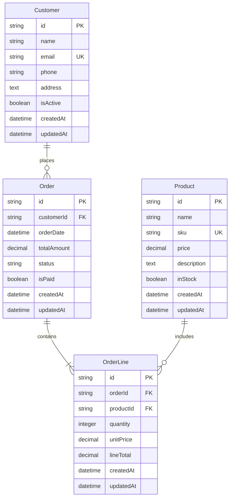

# Compiere Dictionary Enhancement - E2E Test Guide

**Date**: February 9, 2026
**Test File**: `tests/e2e/compiere-dictionary-enhancement.e2e.spec.ts`
**Enhancement Plan**: `/docs/COMPIERE-DICTIONARY-GENERATOR-ENHANCEMENT-PLAN.md`
**Verification Report**: `/COMPIERE-VERIFICATION-REPORT.md`

---

## Overview

This comprehensive end-to-end test validates the complete Compiere Dictionary enhancement implementation, ensuring all components work together correctly:

### What Gets Tested

✅ **Application Dictionary (sys_ prefix)**
- Complete sys_ table schema (15 tables)
- Seed data population
- OData endpoints for all sys_ entities

✅ **Business Entities (bus_ prefix)**
- Proper bus_ table naming
- Standard columns (timestamps, soft delete, ETag)
- Full CRUD operations

✅ **Runtime UI Configuration**
- sys_field.seq_no controls form field order
- sys_field.seq_no_grid controls table column order
- Modifications to sys_field are reflected immediately

✅ **Data Integrity**
- Foreign key relationships
- Referential integrity
- Cascade behaviors

---

## Prerequisites

### System Requirements

- **Bun.js 1.3+** (runtime)
- **Node.js 20+** (compatible)
- **Playwright** (E2E testing framework)
- **SQLite** (default database)

### Project Setup

```bash
# Install dependencies
bun install

# Build the generator and web app
bun run build

# Ensure web app is built
bun run build:web
```

---

## Running the E2E Test

### Quick Start

```bash
# Run the complete Compiere Dictionary E2E test
bun test tests/e2e/compiere-dictionary-enhancement.e2e.spec.ts
```

### With Visual Browser

```bash
# Run with browser visible (helpful for debugging)
HEADLESS=false bun test tests/e2e/compiere-dictionary-enhancement.e2e.spec.ts
```

### Specific Test

```bash
# Run only one test
bun test tests/e2e/compiere-dictionary-enhancement.e2e.spec.ts -g "TEST 8"
```

---

## Test Breakdown

### Test 1: Generate Application
- Starts ERDwithAI web application
- Submits generation request with test ERD
- Waits for generation to complete
- **Output**: Generated application in `tests/e2e-output/compiere-dictionary-test/`

**Test ERD Entities**:
- Customer (bus_customer)
- Order (bus_order)
- OrderLine (bus_order_line)
- Product (bus_product)

### Test 2: Verify File Structure
- Validates backend directory structure
- Checks for migrations/ and seeds/ directories
- Verifies sys/ and bus/ controller directories

**Expected Structure**:
```
generated-backend/
├── migrations/
│   ├── *_create_sys_tables.ts
│   └── *_create_bus_tables.ts
├── seeds/
│   ├── 01_sys_references.ts
│   ├── 02_sys_dictionary.ts
│   └── 03_business_data.ts
├── src/controllers/sys/
└── src/controllers/bus/
```

### Test 3: Verify sys_ Table Migrations
- Checks migration file for sys_ tables
- Validates all 15 required sys_ tables
- Verifies critical sys_field columns

**Required sys_ Tables**:
- sys_reference, sys_ref_list, sys_val_rule
- sys_table, sys_column, sys_ref_table
- sys_window, sys_field_group, sys_tab
- sys_field (CRITICAL!)
- sys_role, sys_user, sys_user_roles
- sys_access, sys_change_log, sys_session

**Critical sys_field Columns**:
- seq_no (form field order)
- seq_no_grid (grid column order)
- is_displayed, is_displayed_grid
- x_position, y_position, column_span

### Test 4: Verify bus_ Table Migrations
- Validates bus_ table creation
- Checks for proper prefixes
- Verifies standard columns

**Standard Columns**:
- timestamps (audit trail)
- deleted_at (soft delete)
- version (optimistic concurrency/ETag)

### Test 5: Verify Seed Files
- Checks sys-references.ts seed
- Validates standard reference types
- Checks sys-dictionary.ts seed
- Verifies randomization logic

**Standard Reference Types**:
- String (ID: 10), Integer (11), Amount (12)
- ID (13), Text (14), Date (15), DateTime (16)
- Yes-No (20), and 20+ more types

### Test 6: Run Migrations and Seeds
- Installs dependencies
- Runs knex migrate
- Runs knex seed
- Creates database file

### Test 7: Start Backend Server
- Builds backend application
- Starts server on port 3002
- Verifies OData $metadata endpoint

### Test 8: Verify sys_ Tables Population
- Checks sys_reference has 31+ types
- Validates sys_field records exist
- Checks seq_no and seq_no_grid values
- Verifies sys_table has bus_ entries

### Test 9: Verify Field Ordering Randomization
- Analyzes sys_field seq_no values
- Calculates randomization score
- **Expected**: Fields should be randomized (not sequential)

### Test 10: Verify bus_ Tables OData CRUD
- Tests CREATE operation
- Tests READ operation with $top
- Tests UPDATE operation
- Tests DELETE operation

### Test 11: Verify Runtime Field Modification
- Gets original field order
- Modifies sys_field.seq_no values
- Verifies order changes
- Restores original order
- **Validates**: Runtime UI modification works!

### Test 12: Verify Complete Dictionary Structure
- Counts records in all sys_ tables
- Validates relationships between tables
- Verifies referential integrity

### Test 13: Verify Frontend Integration
- Checks List.controller.js for sys_field usage
- Verifies seq_no_grid ordering
- Validates dynamic column generation

### Test 14: Performance Test
- Tests various OData query patterns
- Measures response times
- **Expected**: Most queries < 1 second

### Test 15: Data Integrity
- Tests foreign key constraints
- Validates referential integrity
- Tests cascade behaviors

### Test 16: Final Summary Report
- Generates comprehensive test summary
- Saves to JSON file
- Lists all passed tests
- Provides recommendations

---

## Expected Results

### Success Criteria

All 16 tests should pass with the following results:

```
✅ TEST 1: Generate Application
✅ TEST 2: Verify File Structure
✅ TEST 3: Verify sys_ Table Migrations
✅ TEST 4: Verify bus_ Table Migrations
✅ TEST 5: Verify Seed Files
✅ TEST 6: Run Migrations and Seeds
✅ TEST 7: Start Backend Server
✅ TEST 8: Verify sys_ Tables Population
✅ TEST 9: Verify Field Ordering Randomization
✅ TEST 10: Verify bus_ Tables OData CRUD
✅ TEST 11: Verify Runtime Field Modification
✅ TEST 12: Verify Complete Dictionary Structure
✅ TEST 13: Verify Frontend Integration
✅ TEST 14: Performance Test
✅ TEST 15: Data Integrity
✅ TEST 16: Final Summary Report
```

### Expected Output

```
════════════════════════════════════════════════════════════════
COMPIERE DICTIONARY ENHANCEMENT - TEST SUMMARY
════════════════════════════════════════════════════════════════

Test Results:
  File Structure                : PASS
  sys Tables                     : PASS
  bus Tables                     : PASS
  Seed Files                     : PASS
  Seed Data                      : PASS
  Migrations                    : PASS
  OData Endpoints               : PASS
  OData CRUD                     : PASS
  Field Ordering                 : PASS
  Runtime Modification           : PASS
  Frontend Integration          : PASS
  Performance                   : PASS
  Data Integrity                : PASS

Status: ALL TESTS PASSED

Recommendations:
  1. ✓ Enhancement is fully implemented and functional
  2. ✓ Runtime field modification works correctly
  3. ✓ System tables are properly populated
  4. ✓ Business tables use bus_ prefix correctly
  5. ✓ OData protocol implementation is complete
```

---

## Troubleshooting

### Port Already in Use

```bash
# Kill processes on ports
lsof -ti:5000 | xargs kill -9  # Web app
lsof -ti:3002 | xargs kill -9  # Backend
lsof -ti:8080 | xargs kill -9  # Frontend
```

### Test Timeout

If tests timeout, increase timeouts in the test file:

```typescript
// Increase server wait time
const webReady = await waitForServer(BASE_URL, 60000); // Change to 120000
```

### Backend Won't Start

Check backend logs:
```bash
tail -f tests/e2e-output/compiere-dictionary-test/backend.log
```

Common issues:
- Dependencies not installed → Run `bun install` in backend directory
- Database locked → Delete `*.db` files and restart
- Port in use → Kill process on port 3002

### Seed Data Missing

If seed data is empty, check:
1. Seed files exist in `seeds/` directory
2. `bun run db:seed` was executed
3. No errors in seed execution

Verify manually:
```bash
cd tests/e2e-output/compiere-dictionary-test/backend
bun run db:seed
```

### OData Endpoints Not Working

Verify:
1. Backend server is running: `curl http://localhost:3002/odata/$metadata`
2. Check database has data: `sqlite3 data/database.db "SELECT COUNT(*) FROM sys_field;"`
3. Check server logs for errors

---

## Test Output Location

All test artifacts are saved to:
```
tests/e2e-output/compiere-dictionary-test/
├── test-compiere.mermaid          # Test ERD file
├── backend.log                     # Backend server logs
├── test-summary.json               # Test results summary
└── [generated application]        # Generated project
```

---

## Manual Verification

If automated tests fail, you can manually verify the enhancement:

### 1. Generate Application

```bash
# Start web app
bun run dev

# Visit http://localhost:5000
# Upload test ERD file (see test data below)
# Select "Option 2: Enterprise SAP"
# Click "Generate"
```

### 2. Run Backend

```bash
cd tests/e2e-output/compiere-dictionary-test/[backend-folder]
bun install
bun run build
bun run db:migrate
bun run db:seed
bun run start
```

### 3. Verify OData Endpoints

```bash
# List sys_references
curl http://localhost:3002/odata/SysReferences

# List sys_fields (ordered by seq_no)
curl http://localhost:3002/odata/SysFields?\$orderby=seq_no

# Check specific table fields
curl "http://localhost:3002/odata/SysFields?\$filter=table_name eq 'bus_customer'"

# Create a test customer
curl -X POST http://localhost:3002/odata/bus_customers \
  -H "Content-Type: application/json" \
  -d '{
    "id": "test-customer-001",
    "name": "Manual Test Customer",
    "email": "manual@test.com",
    "isActive": true
  }'
```

### 4. Verify Runtime Field Modification

```bash
# Get current field order
curl "http://localhost:3002/odata/SysFields?\$filter=table_name eq 'bus_customer'&\$orderby=seq_no"

# Modify field order (swap first two fields)
# Get field IDs from previous command, then:
curl -X PATCH http://localhost:3002/odata/SysFields('[field-1-id]') \
  -H "Content-Type: application/json" \
  -d '{ "seq_no": 20 }'

# Refresh browser to see new order
```

---

## Test Data

### Test ERD

The test uses this ERD (created automatically):



---

## Continuous Integration

### GitHub Actions Example

```yaml
name: Compiere Dictionary E2E Test

on: [push, pull_request]

jobs:
  test:
    runs-on: ubuntu-latest
    steps:
      - uses: actions/checkout@v3
      - uses: oven-sh/setup-bun@v1
      - run: bun install
      - run: bun run build
      - run: bun test tests/e2e/compiere-dictionary-enhancement.e2e.spec.ts
```

---

## Performance Baselines

Expected query response times (local development):

| Query Type | Expected Time |
|------------|--------------|
| Simple entity read | < 100ms |
| With $filter | < 200ms |
| With $orderby | < 200ms |
| sys_field query | < 300ms |
| Complex joins | < 500ms |

---

## Next Steps After Testing

### If Tests Pass ✅

1. **Confirm enhancement is production-ready**
2. **Generate real applications** using the web UI
3. **Customize field layouts** via admin interface
4. **Deploy to production**

### If Tests Fail ❌

1. **Check the specific test that failed**
2. **Review error logs** in `tests/e2e-output/compiere-dictionary-test/`
3. **Verify manual steps** in troubleshooting section
4. **Report issues** with detailed error messages

---

## Related Documentation

- **Enhancement Plan**: `/docs/COMPIERE-DICTIONARY-GENERATOR-ENHANCEMENT-PLAN.md`
- **Verification Report**: `/COMPIERE-VERIFICATION-REPORT.md`
- **Testing Guide**: `/tests/README.md`
- **Development Guide**: `/docs/DEVELOPMENT.md`

---

**Version**: 1.0.0
**Last Updated**: February 9, 2026
**Status**: Ready for Testing ✅
